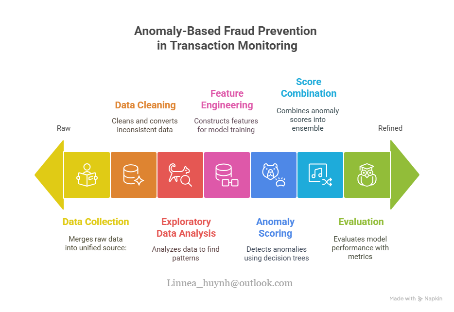

# Anomaly-Based Fraud Prevention in Transaction Monitoring

### 🧾 Project Overview

This **Proof of Concept (PoC)** data science project explores techniques to detect potentially fraudulent banking transactions. It reflects my growing interest in **Financial Crime Prevention**, especially in times of **geopolitical tension**, where abnormal payment behavior may rise.

---

### 🕒 Simulation Context

| **Item**               | **Detail**                                                                                                                                                      |
|------------------------|------------------------------------------------------------------------------------------------------------------------------------------------------------------|
| **Date Range**         | 2025‑04‑02 → 2025‑07‑02                                                                                                                                           |
| **Scenario**           | A simulated trade conflict in mid-2025 leads to increased abnormal cross-border transactions.                                                                    |
| **Currencies**         | SEK, DKK, NOK → Converted to **EUR** using the **Riksbanken API** in real time.                                                                                  |
| **Transaction Volume** | 10,716 transactions (31 categorical, 9 numerical features), formatted per **PSD2 Open Banking API**.                                                             |
| **Data Collection**    | Combine transaction records, KYC customer profiles, and summary statistics into one dataset.                                                                     |
| **Data Cleaning**      | Currency conversion, duplicate removal, and format standardization.                                                                          |
| **EDA**                | Descriptive statistics, univariate and bivariate analysis.                                                                                              |
| **Feature Engineering**| Handle missing values, create risk indicators, normalize and scale features.                                                           |
| **Anomaly Detection**  |  Apply Isolation Forest and other tree-based models.                                                                                       |
| **Score Combination**   |  Ensemble model outputs to generate a unified anomaly score.                                                                              |
| **Model Evaluation:**   |  Use metrics such as Precision-Recall, ROC-AUC, confusion matrix, and feature importance.                                                                           |

---

## 🎯 Project Objectives

### 1. 📊 Generate realistic Nordic transactions

### 2. 🧠 Build Domain Expertise in Transaction Monitoring Systems (TMS)

- Gained insight into how **TMS** operate within financial institutions.  
- Learned how **AI combines with traditional rule-based systems** to better detect fraud and increase true positive rates.

*Challenges and AI-Driven Solutions:*

- **Traditional rule-based detection:**  
  Static rule-based systems are inflexible and often cause many false alarms.  
  **AI solution:** Combine rules with AI models that personalize and learn from data, increasing true positive rates.

- **Outdated detection scenarios:**  
  Fraud detection rules can become outdated as transaction patterns evolve.  
  **AI solution:** Use AI to adaptively learn and suggest scenario tuning based on new transaction behaviors.

- **Slow investigations and manual reporting:**  
  Manual alert handling slows down investigations.  
  **AI solution:** Automate alerting with clear, explainable outputs aligned with **SAR** reporting formats to speed up reviews.

### 3. 🔁Follow data science workflow best practices and write reusable code.

---

## 🔧 Tools & Technologies Used

- **Python**: Pandas, NumPy, Scikit-learn for modeling and preprocessing  
- **SQL (SQLite3)**: For feature aggregation and data analysis  
- **Riksbanken API**: For live currency conversion to EUR  
- **Jupyter Notebooks**: For exploratory data analysis and workflow tracking  
- **Nordea Open Banking API schema**: To simulate realistic PSD2-compliant transaction data  
